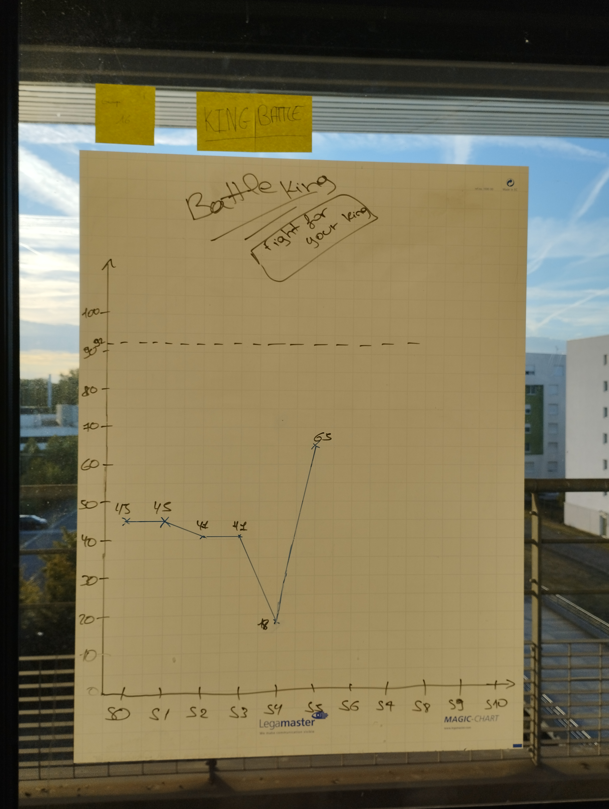

<link rel="stylesheet" href="style/styleCR.css">

# SAE 3.01 - Mini projet Agile  
## **_Groupe n°16_**
## _King Battle - Fight for your King !_
Membre du groupe :
- BILLY ALAN
- DA COSTA VEIGA Adrien
- HOUSET Sophie
- LARSONNIER Cedric 
- ZAIDI Mehdi

   
   
 
# **Sprint 0**  

## **Ce que nous avons fait durant ce sprint**
Début du projet.  
Recherche d'idées sur l'application / le logiciel à réaliser.  -> jeu d'échecs inspiré par le jeu vidéo "SHOTGUN KING" -> multijoueur (JOUEUR CONTRE JOUEUR)  
Brainstorm autour des fonctionnalités à implémenter   
Tâches à réaliser :  
- Création du plateau de jeu  
- Affichage du plateau de jeu  
- Personnages (pièces) -> Roi  
- Déplacements des pièces -> Roi  
- Attaques des pièces -> Roi  
- Types d'armes  
- Création des joueurs (Joueur 1 et Joueur 2)  
- Gestion des tours  
- Gestion des cas victoire et défaite  

Idées supplémentaires émises :   
- Bonus  
- Menu principal   
- Interaction avec les utilisateurs (utilisation de pseudonymes)  
- Points  

## **Ce que nous allons faire durant le prochain sprint**
Création du plateaude jeux, il devra être possible de visualiser le plateau de jeu. 
Création des classes des personnages (BasePawn, King, Queen, Rook, Bishop, Knight,Pawn), il devra être possible de créer des personnages  

## **Prochain sprint**
Début de la programmation du plateau de jeu et création du système de personnages  

## **Rétrospective**

## **Sur quoi avons-nous butté ?**
Le choix des mécaniques de jeu furent le plus complexe à choisir. En effet elles devaient être assez complexes pour que le projet ne soit pas trop simple sans pour autant être trop exigeantes non plus pour que nous puissions réaliser le projet dans le temps imparti.

## **PCDA**
Rien à signaler lors de ce sprint

   
   
 
# **Sprint 1**

## **Ce que nous avons fait durant ce sprint**
Création de l'affichage graphique du projet (plateau de jeu) -> échiquier format standard (8 casses x 8 cases).  
Création des classes visant à créer des personnages (King, Queen, Rook, Bishop, Knight, Pawn).  

## **Ce que nous allons faire durant le prochain sprint**
Pouvoir afficher un personnage (King), il devra être possible d'afficher le personnage King.  
Commencer la création des objets des personnages (armes), il devra être possible de créer des armes.  
Créer un menu principal, il devra être possible dafficher le menu principal de l'application.  

## **Rétrospective**
A la fin du premier sprint. Il était possible de visualiser le plateau de jeu qui est un échiquier au format classique  (8 cases x 8 cases)  
Nous pouvions également créer des personnages, cependant, ils ne sont pas encore liés au plateau de jeu et sont donc créés séparément dans leurs classes respectives.  

## **Sur quoi avons-nous butté ?**
Nous avons connu quelques soucis avec la configuration de l'outil de partage Git qui nous a fait perdre un peu de temps au début du sprint.  

## **PCDA**
Rien à signaler lors de ce sprint

   
   
 
# Sprint 2

### **Ce que nous avons fait durant ce sprint**
Nous avons terminé l'affichage graphique du plateau qui est donc fonctionnel. Il est possible d'afficher des personnages des deux couleurs 
de pions aux échecs à savoir noir et blanc (couleur de fond).  
Nous avons également créé les classes nécessaires à la création des armes et nous pouvons donc en créer. N'étant pas encore liées aux personnages, 
ils n'est cependant pas encore possible de les utiliser en jeu.   
Le menu principal du jeu est également terminé et reste à être implémenté dans le programme principal.  

### **Ce que nous allons faire durant le prochain sprint**
Commencer à programmer les déplacements de King, il devra être possible de déplacer le King.  
Commencer à programmer la mécanique des attaques.

## **Rétrospective**
A la fin du second sprint. Il était possible de visualier le plateau de jeu ainsi que des personnages sur le plateau avec les couleurs
correspondantes aux joueurs (Noir et Blanc).  

### **Sur quoi avons-nous butté ?**
Git pose encore quelques soucis pour certains membres de l'équipe mais cela va en s'améliorant.  

### **PCDA**
On remarque que nous avons peut être vu trop gros concernant certains points. Nous avons également peut être été trop ambitieux.  
Nous avons donc de nouveaux découper le projets en sous-problèmes afin de pouvoir réaliser des démos fonctionnelles et livrables à tous moments.  

   
   
 
# Sprint 3

### **Ce que nous avons fait durant ce sprint**
Au cours de ce sprint. Nous avons débuté le système de déplacements des pièces en se concentrant dans un premier temps sur ceux de la pièces King.
A ce moment précis. Les déplacements sont réalisés de manière aléatoire afin de visualiser les déplacments sur les différentes cases du plateau et également 
visualiser de potentiels bugs qui pourraient apparaître pour les corriger par la suite.
### **Ce que nous allons faire durant le prochain sprint**
Nous devons maintenant ajouter la possibilité aux joueurs de choisir la case sur laquelle il souhaite déplacer son pion.
## **Rétrospective**
A la fin du troisième sprint. Le client peut maintennat visualiser un plateau de jeu dynamique et le déplacements (aléatoires) de la pièce King sur ce dernier.

## **Sur quoi avons-nous butté ?**
Aucun problème majeur à signaler lors de ce sprint
## **PCDA**
Rien à signaler lors de ce sprint.

   
   
 
# Sprint 4

## **Ce que nous avons fait durant ce sprint**
Pour ce quatrième sprint, nous avons terminé la programmation des déplacements des pièces en se basant sur les déplacements du King. Ainsi, il est à présent possible de déplacer les pièces sur le plateau de jeu. Nous avons également implémenté le système d'attaque avec ses spécifications (en fonction de l'arme utilisé par le personnage, sa zone d'action peut être plus ou moins étendue et sa puissance plus ou moins élevée). Ainsi, il est maintenant possible de "jouer" à King Battle.
Les systèmes de tours et de victoire / défaite on également été implémenté. 
Nous avons ainsi pu fournir une démo. fonctionnelle dans laquelle nous pouvons déplacer les Kings présents sur le plateau tour à tour et attaquer. 

## **Ce que nous allons faire durant le prochain sprint**
Nous comptons implémenter le menu principal de l'application. Débuter le développement des mécaniques supplémentaires de King Battle à savoir les atouts à la suite d'une victoire ou la perte d'une manche ainsi qu'améliorer les interactions avec l'utilisateur.

## **Rétrospective**
Nous avons bien avancé sur notre projet lors de ce sprint car il résulte de l'assemblage des travaux réalisés aux sprints précédent. Nous sommes satisfait du résultat de la démo livrée à la fin de ce troisième sprint. Ainsi, nous avons pu répondre à un grand nombre de nos user's stories et complété une bonne partie des spécificités techniques demandées pour ce projet.
Nous avons ainsi terminé la première partie de notre projet qui était donc de pouvoir afficher le plateau de jeu, déplacer sa pièce sur le plateau, attaquer la pièce adverse en se concentrant sur la pièce King sans les mécaniques de jeu avancées prévues pour la suite du développement.

## **Sur quoi avons-nous butté ?**
Aucun problème majeur à signaler lors de ce sprint.

## **PCDA**
Rien à signaler lors de ce sprint.

   
   
 
# Sprint 5

### **Ce que nous avons fait durant ce sprint**
Etant donné que nous avons terminé la première partie de notre projet. Nous avons utilisé ce sprint afin de redéfinir le travail qu'il reste à faire dans la seconde partie du projet King Battle. Ainsi, nous avons redéfini les users stories concernant les mécaniques avancées de notre jeu. 
Concernant le jeu directement, nous avons améliorer l'affichage graphique par l'ajout des points de vie de chacune des pièces présentes sur le plateau par couleur (WHITE / BLACK) ainsi qu'ajouté le menu principal de notre jeu qui permettra de démarrer une nouvelle partie, visualiser les règles du jeu ou de le quitter.
Nous avons également commencer à réfléchir au développement des mécaniques avancées.
### **Ce que nous allons faire durant le prochain sprint**
Commencer le développement de la gestion des évènements post victoire / défaite (ajout d'une pièce sur le plateau pour le gagnant / choisir un bonus pour le perdant).
Commencer le développement des bonus à choisir pour le perdant.
Commencer le développement des différents déplacements des diverses pièces.
## **Rétrospective**
Pas de grande avancée d'un point de vue purement technique au cours de ce sprint. Cependant, l'organisation et l'estimation des tâches restantes nous permet de mieux envisager l'avancée future du projet.

## **Sur quoi avons-nous butté ?**
Aucun problème majeur à signaler lors de ce sprint

## **PCDA**
Rien à signaler lors de ce sprint.

   
   
 
# Sprint 6

### **Ce que nous avons fait durant ce sprint**
Durant ce sprint, nous avons une nouvelle fois amélioré l'affichage du plateau en jeu par l'ajout d'indications graphiques pour le(s) joueur(s) concernant les déplacements réalisables et de même pour de potentielles attaques. Les déplacements possibles s'affichant en vert et les pièces à attaquer en rouge.
Nous avons également commencé le développement des bonus déclenchés en fin de manche en cas de défaite d'un jour.
### **Ce que nous allons faire durant le prochain sprint**
Nous allons revoir le gameplay de la première manche afin de le rendre plus intéressant pour les joueurs.  
Continuer le développement des bonus en cas de défaite d'un joueur.  
Gestion des matchs.  

## **Rétrospective**
Les nouveautés sont avant tout visuelles et non mécaniques. Actuellement nous travaillons sur les prochaines mécaniques de gameplay concernant les bonus en cas de défaite qui représentent un plus gros volume de travail notamment vis à vis de la modélisation adoptée pour leurs réalisations.   

## **Sur quoi avons-nous butté ?**
Nous avons rencontré encore quelques soucis avec l'outil Git. Soucis réglés rapidement en début de sprint. 

## **PCDA**
Nous devrons utiliser d'avantage la documentation de l'outil Git afin d'éviter de rencontrer à nouveau ce genre de soucis ou du moins de pouvoir le régler sans faire appel à un autre membre pour ne pas le gêner dans son travail.s

   
   
 
# Sprint 7

### **Ce que nous avons fait durant ce sprint**
A la fin du septième sprint, il était possible d'afficher et de jouer avec plus d'une pièce sur le plateau de jeu. Ainsi, il était possible de jouer par exemple avec le King et le Bishope ou même un Rook. Il est possible de choisir la pièce que nous souhaitons utiliser. Les déplacements propres aux différentes pièces sont également implémentés.  
Lorsqu'un jour gagne la manche, une pièce de sa couleur est ajoutée sur le plateau et peut être utiliser par le joueur gagnant comme bon lui semble.
Un Bishop se déplace donc comme dans la version classique des échecs, à savoir en diagonale par exemple.
Le développement des bonus en cas de défaie a également bien avancé.
### **Ce que nous allons faire durant le prochain sprint**
Continuer le développement des bonus en cas de défaites.
Revoir le gameplay de la première manche.
## **Rétrospective**

## **Sur quoi avons-nous butté ?**
Aucun problème majeur à signaler lors de ce sprint

## **PCDA**
Rien à signaler lors de ce sprint.

   
   
 
# Sprint 8

### **Ce que nous avons fait durant ce sprint**
Au cours de ce sprint, nous avons terminé le développement des bonus en cas de défaite, il ne reste plus qu'à les implémenter dans le programme principal afin de pouvoir utiliser la mécanique en jeu. Nous n'avons pas fait de progrès visibles d'un point de vue client. 
### **Ce que nous allons faire durant le prochain sprint**
Implémenter les bonus en cas de défaite d'un joueur.
Ecrire les tests des différentes méthodes du projet.

## **Rétrospective**

 

## **Sur quoi avons-nous butté ?**
Aucun problème majeur à signaler lors de ce sprint

## **PCDA**
Rien à signaler lors de ce sprint.

   
   
 
# Sprint 9

### **Ce que nous avons fait durant ce sprint**
Pour ce dernier sprint, il ne nous restait qu'à implémenter les bonus. Néanmoins, nous avons décidé de revoir le gameplay de manière à rendre le jeu plus agréable pour les deux joueurs. Ainsi, dans un souci d'égalité, nous avons préféré tout simplement ajouter une pièce aléatoirement à chacun des deux joueurs ce qui crée ainsi plus d'implication des joueurs pour relancer la partie malgré une potentielle défaite à la première manche. Ces bonus représentent donc une possibilités d'ajout dans le futur.

### **Ce que nous allons faire durant le prochain sprint**
Fin de projet.

## **Rétrospective**
Nous avons finalement décidé de priviligier l'expérience de jeu des joueurs plutôt que d'ajouter les bonus initialement prévu. Nous avons eu beaucoup de retour pendant la phase de développement nous laissant comprendre qu'un côté pourrait être plus avantagé qu'un autre. Ainsi, par l'ajout d'une pièce aléatoire à la fin d'une manche, cela permet de garder une forme d'égalité entre les joueurs et ainsi permet de garder l'implication des deux joueurs sans que l'un d'entre eux se sentent impuissant et décide d'abandonner.  

## **Sur quoi avons-nous butté ?**
Aucun problème majeur à signaler lors de ce sprint

## **PCDA**
Rien à signaler lors de ce sprint.  

#### 
  SAé 3.01 - Mini Projet Agile - BUT INFORMATIQUE S3 - BILLY ALAN, DA COSTA VEIGA Adrien, HOUSET Sophie,LARSONNIER Cedric, ZAIDI Mehdi.   
